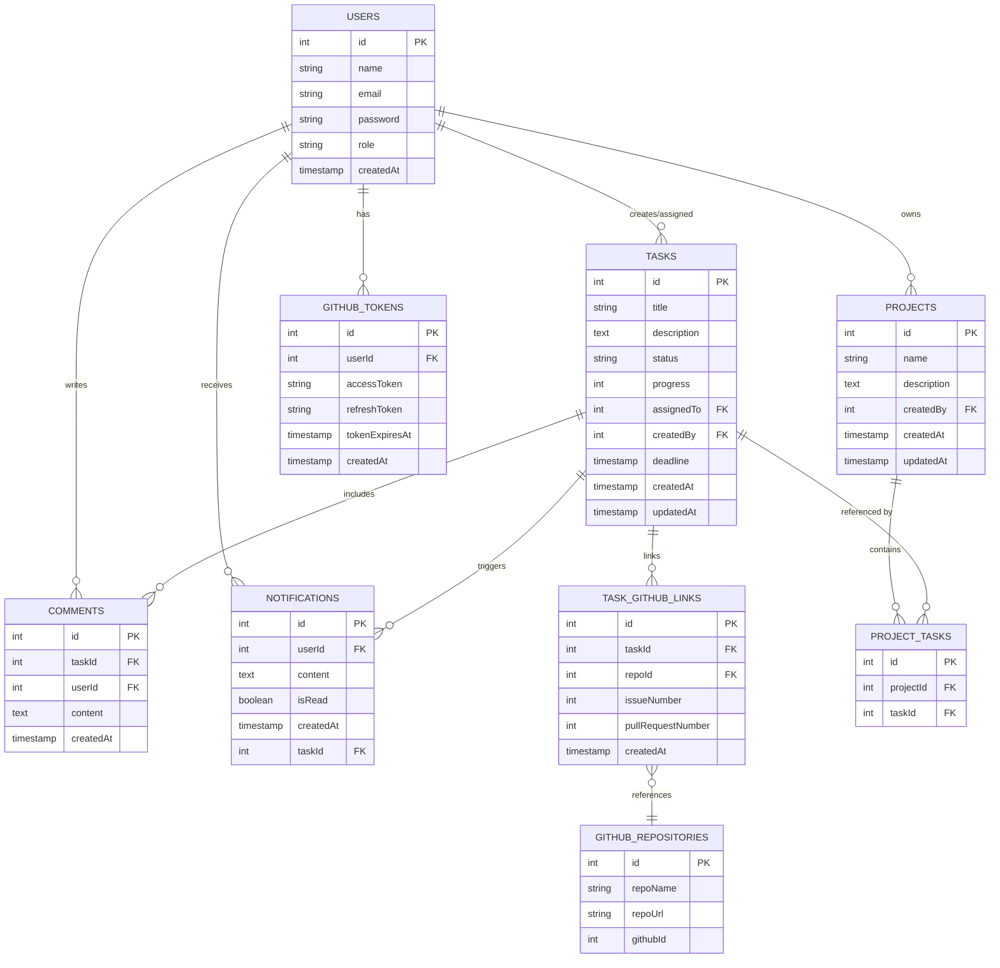

# DevSync Database ER Diagram

Below is a simple ER Diagram for our database to help our teammates understand the main tables and their relationships.

This diagram provides an overview of the database structure with primary and foreign keys along with key relationships.
